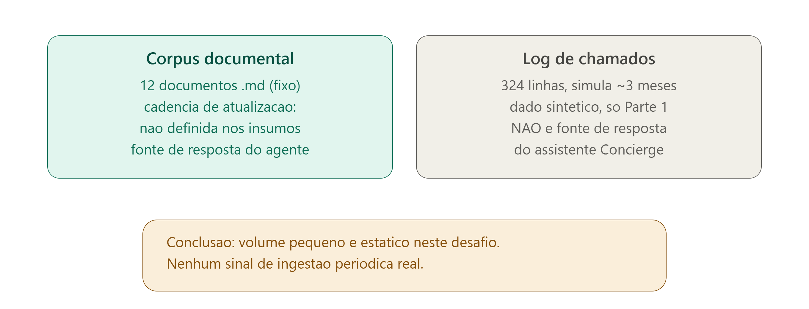
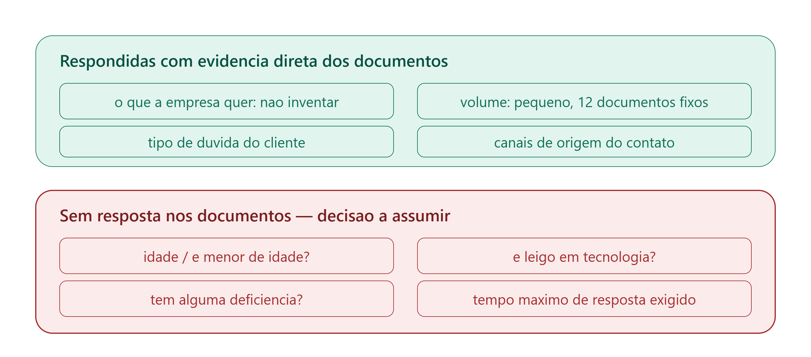
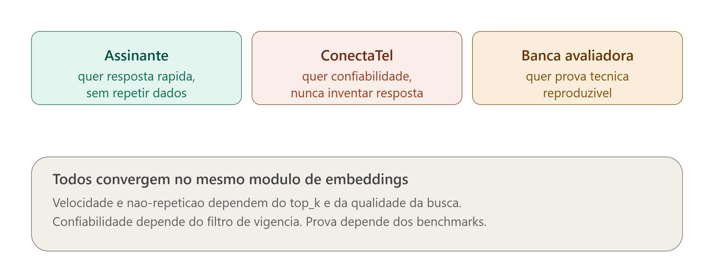
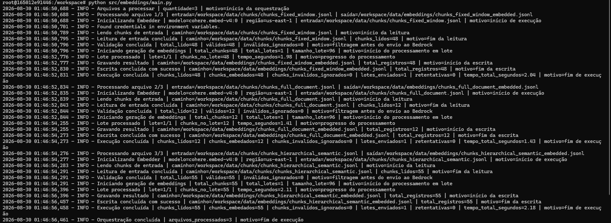
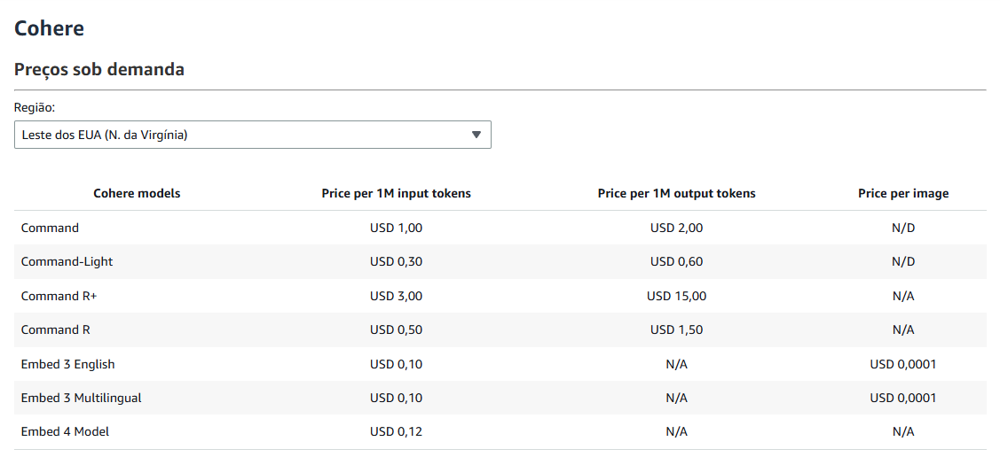
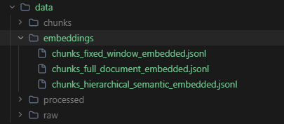
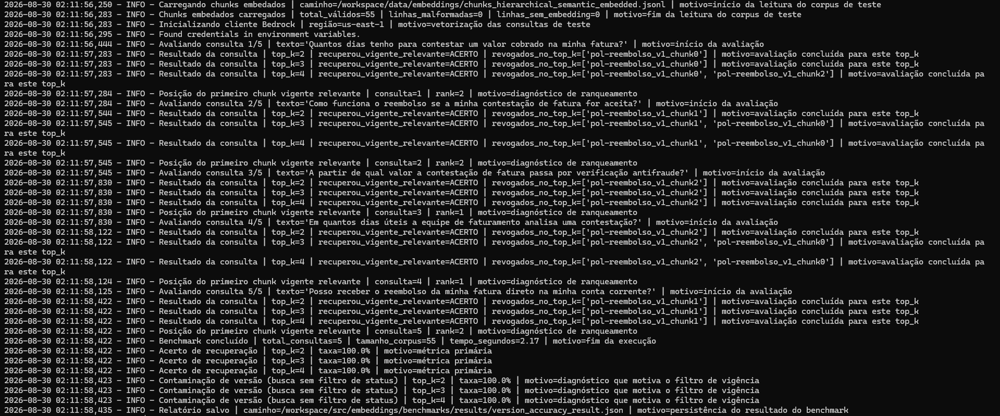
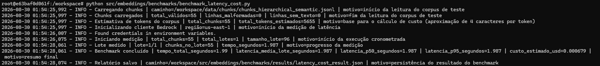

# Embeddings — Concierge ConectaTel

> 🇧🇷 Português abaixo | 🇬🇧 [English version below](https://claude.ai/chat/2f914536-5099-42c0-a4b5-ae9e5211d2ee#english-version)

---

## 🇧🇷 Versão em português

### Resumo executivo


| Decisão / Resultado                              | Valor                                                                                                                                       |
| ------------------------------------------------ | ------------------------------------------------------------------------------------------------------------------------------------------- |
| Modelo de embedding                              | **Cohere Embed v4** (`cohere.embed-v4:0`), fixo, sem fallback                                                                               |
| Motivo da escolha                                | Único modelo avaliado no Bedrock com suporte declarado ao português (Titan é "Preview"; Nova é multimodal desnecessário e ~27× mais caro)   |
| Acerto de recuperação medido                     | **100%** em `top_k = 2, 3 e 4` — o chunk vigente relevante aparece sempre entre os 2 primeiros resultados (ver seção Benchmarks)             |
| Contaminação de versão sem filtro de status      | **100% das consultas** trazem um chunk revogado no top-k — por isso a camada de busca deve filtrar por vigência antes de ranquear           |
| `top_k` padrão recomendado                       | **3** — margem protetiva; os três cortes empatam em 100% de acerto e o 3º chunk serve de desempate se os 2 primeiros forem concorrentes     |
| Custo estimado para vetorizar o corpus inteiro   | **USD 0,000679** (55 chunks, estratégia hierárquica — ver seção Benchmarks)                                                                 |
| Diferença de custo vs. Titan (modelo descartado) | Inferior a 1 centavo de dólar por execução completa — irrelevante frente ao ganho de confiabilidade linguística                             |


O restante deste documento detalha como cada um desses números foi obtido e como reproduzi-los.

### Contexto do desafio

Este módulo é a terceira etapa do pipeline de dados do **Concierge ConectaTel** (hackathon squad 3, APR26), responsável por transformar os *chunks* de texto gerados na etapa de chunking em vetores de embedding, prontos para busca por similaridade (RAG).

```
                          ┌─ LOCAL:  main.py                  → data/embeddings/*_embedded.jsonl
data/chunks/*.jsonl  ──▶  │                                     (+ upload_embeddings_to_s3.py → s3://<embeddings-bucket>/)
(saída do chunking)       └─ AWS:    lambda_function.py        → s3://<embeddings-bucket>/*_embedded.jsonl
                                     (disparada por chunks/*.jsonl no bucket processed)
```

O módulo tem **dois modos de execução**, com a mesma lógica de embedding (`embedder.py`):

- **Local** — `main.py` lê `data/chunks/`, grava `data/embeddings/`. Rápido para desenvolver e testar; `upload_embeddings_to_s3.py` publica no S3 depois.
- **AWS** — `lambda_function.py` é a Lambda `${project_prefix}-embeddings` (criada pelo Terraform), disparada quando um `chunks/*.jsonl` aparece no bucket `processed`. Lê do S3, grava no bucket `embeddings`. Mesmo padrão da Lambda de chunking.

O corpus documental é fixo e fornecido pelo desafio: 12 documentos Markdown (planos, políticas, FAQ e procedimentos da ConectaTel — empresa fictícia), cada um com metadados de vigência no cabeçalho (`doc_family_id`, `version_ordinal`, `effective_from`, `effective_to`, `status`). A família `pol-reembolso` é a única com duas versões (v1 revogada, v2 vigente) e é o caso de teste central deste módulo, incluindo no painel de avaliação, que garante ao menos uma pergunta sobre vigência.

### Quem usa isso e por quê (contexto de produto/UX)

> **Por que essa seção existe aqui:** decisões técnicas deste módulo (formato de saída, tamanho de chunk implícito no `top_k`, latência aceitável) não são neutras — elas respondem a um público e a uma urgência. Antes de justificar o modelo escolhido, vale deixar explícito o que os documentos da ConectaTel realmente dizem sobre esse público, e onde a resposta simplesmente não existe nos insumos.

**O que a ConectaTel (a empresa fictícia do desafio) quer, na prática:** a `politica_suporte_escalonamento.md` é explícita — o assistente deve reconhecer os limites do que pode responder e nunca "inferir uma resposta" quando não há fonte suficiente na base vigente. Isso é o requisito central do produto: confiabilidade acima de cobertura. Um "não sei, vou te passar para um humano" é um resultado aceitável; uma resposta inventada não é.

**Volume e cadência de dados — perguntas respondidas com evidência real dos insumos:**


| Pergunta                                      | Resposta com base nos documentos                                                                                                                                                                                                                                                                                                        |
| --------------------------------------------- | --------------------------------------------------------------------------------------------------------------------------------------------------------------------------------------------------------------------------------------------------------------------------------------------------------------------------------------- |
| A empresa recebe grande volume de documentos? | Não. O corpus é fixo em **12 documentos Markdown**, sem indicação de crescimento contínuo nos insumos fornecidos.                                                                                                                                                                                                                       |
| Com que frequência o corpus é atualizado?     | **Não definido** em nenhum documento. Não há menção a cadência diária, mensal ou anual de revisão de política — o único caso de versionamento observado (`pol-reembolso` v1 → v2) é um evento pontual, não uma rotina documentada.                                                                                                      |
| Existe algum log de alto volume?              | Existe o `log_chamados_sintetico.csv`, com **324 linhas simulando ~3 meses** de atendimentos — mas ele é explicitamente **dado sintético da Parte 1 (pipeline de dados)** e o próprio `dicionario_dados.md` afirma que ele **não deve ser usado como fonte de resposta do assistente**. Ou seja: não é volume de produção deste módulo. |




**Público-alvo — perguntas respondidas com evidência real, e o que fica em aberto:**


| Pergunta                                                             | Resposta com base nos documentos                                                                                                                                                                                                                                                                                                                 |
| -------------------------------------------------------------------- | ------------------------------------------------------------------------------------------------------------------------------------------------------------------------------------------------------------------------------------------------------------------------------------------------------------------------------------------------ |
| Quem é o usuário final?                                              | O "assinante" da ConectaTel — alguém que já contratou um plano. Isso está implícito em todo o corpus (planos, faturas, cancelamento são temas de quem já é cliente).                                                                                                                                                                             |
| Por quais canais ele chega?                                          | Chat, telefone, aplicativo e loja física — citados explicitamente em `faq_geral.md`.                                                                                                                                                                                                                                                             |
| É menor ou maior de idade?                                           | **Não definido.** Nenhum documento menciona faixa etária do assinante.                                                                                                                                                                                                                                                                           |
| É leigo em tecnologia ou não?                                        | **Não definido.** Nenhuma menção a nível de letramento digital.                                                                                                                                                                                                                                                                                  |
| Tem alguma deficiência a considerar?                                 | **Não definido.** Nenhuma menção a acessibilidade (visual, auditiva, motora ou cognitiva).                                                                                                                                                                                                                                                       |
| O sistema precisa ser rápido? Existe um limite de tempo de resposta? | **Não definido numericamente.** O único sinal indireto é o critério de escalonamento: se o assistente "não encontra informação para responder com segurança", ele deve reconhecer a limitação — o que implica que uma resposta rápida e correta é preferível a uma resposta lenta e completa, mas nenhum SLA em segundos ou minutos é declarado. |
| A interface final precisa ser simples?                               | **Não definido como requisito formal.** O desafio não prescreve nenhuma ferramenta de interface (a Stretch de UI é escolha livre do squad, documentada no README do pacote de dados).                                                                                                                                                            |




**Como o assinante age, na prática, ao interagir com o assistente:**

O corpus define, com precisão, a lógica de decisão que o assistente segue diante de uma dúvida do assinante. Essa lógica está descrita em `politica_suporte_escalonamento.md` e se resume a três caminhos possíveis a partir de uma mesma pergunta.


O fluxo funciona da seguinte forma:

1. **Entrada.** O assinante chega com uma dúvida por um dos quatro canais documentados: chat, telefone, aplicativo ou loja física.
2. **Busca.** O assistente busca no corpus vigente por similaridade, usando os embeddings gerados por este módulo.
3. **Decisão — três caminhos possíveis**, conforme o caso se enquadre:
  - **Responde diretamente**, quando há fonte suficiente na versão vigente do documento relevante.
  - **Reconhece a limitação** ("não sei"), quando não há fonte suficiente na base vigente — sem inferir uma resposta.
  - **Escala imediatamente** para um humano, sem tentar responder, quando o caso se enquadra em um dos 8 critérios obrigatórios definidos em `politica_suporte_escalonamento.md` (suspeita de fraude, contestação de fatura acima de R$ 500, contestação de multa de fidelidade, alteração de titularidade, reclamação em órgão externo, relato de conduta abusiva, problema que exige visita presencial, ou pergunta sem fonte suficiente quando o tema é sensível ou o cliente insiste).
4. **Desfecho.** Nos casos de "não sei", o atendimento é encerrado sem escalonamento se o cliente não insistir e o tema não for sensível; caso contrário, segue para escalonamento — assim como nos casos que já se enquadravam em um critério obrigatório desde o início. Todo escalonamento carrega consigo o campo `historico_ja_levantado`, para que o atendente humano não precise pedir ao assinante para repetir informações já fornecidas.

**Os três públicos que este módulo indiretamente serve, ao mesmo tempo:**



- O **assinante** (usuário final do agente) quer uma resposta rápida e não quer repetir informação já dada, caso seja escalado para um humano — isso está na `politica_suporte_escalonamento.md`, no campo `historico_ja_levantado` do registro de escalonamento.
- A **ConectaTel** quer confiabilidade: nunca citar uma política revogada, nunca inventar. É o motivo direto do benchmark `benchmark_version_accuracy.py` deste módulo existir.
- A **banca avaliadora** do desafio quer prova técnica reproduzível — código rodando, README preciso, resultado auditável. É o motivo direto da seção de evidências espalhada por este documento.

**Implicações práticas para este módulo de embeddings**, derivadas diretamente da tabela acima:

- Como o corpus é pequeno e estático (12 documentos), não há necessidade de infraestrutura de reprocessamento incremental — o `Embedder` roda o lote inteiro a cada execução, o que é a escolha correta dado o volume real, não uma limitação a corrigir depois.
- Como não há requisito numérico de latência, o retry com backoff exponencial (até 4 tentativas, 1s–8s) prioriza **corretude sobre velocidade bruta** — uma escolha justificável precisamente porque nenhum documento exige resposta em um teto de segundos.
- Como o público de acessibilidade/letramento não é definido, este módulo não assume nada sobre o consumidor final do vetor gerado (isso é responsabilidade da camada de geração de resposta, fora deste módulo) — mas documenta a lacuna aqui para que quem for desenhar o prompt do agente saiba que essa decisão ainda está em aberto.

### Por que Cohere Embed v4

> **Veredito:** Cohere Embed v4 selecionado. É o único, entre os três avaliados no Bedrock, que declara suporte real ao português — não "Preview", não "multilíngue genérico". A diferença de custo para o Titan (a segunda opção) é irrelevante neste corpus (< 1 centavo por execução completa).


| Critério                     | Cohere Embed v4 (escolhido)                        | Amazon Titan Text Embeddings V2                         | Amazon Nova Multimodal Embeddings                                                                   |
| ---------------------------- | -------------------------------------------------- | ------------------------------------------------------- | --------------------------------------------------------------------------------------------------- |
| Suporte a português          | Declarado explicitamente na documentação do modelo | Suporte multilíngue listado como **Preview**            | Suporte multilíngue geral, sem foco declarado em PT                                                 |
| Modalidade                   | Texto (e multimodal, não utilizado aqui)           | Texto                                                   | Multimodal (texto, imagem, vídeo, áudio)                                                            |
| Necessidade real do projeto  | Corpus 100% textual em português                   | Corpus 100% textual em português                        | Corpus 100% textual em português                                                                    |
| Custo (Bedrock, sob demanda) | USD 0,12 / 1M tokens de entrada                    | USD 0,02 / 1M tokens de entrada (referência de mercado) | Preço por request/segundo de mídia — ordem de grandeza muito superior para uso apenas textual       |
| Decisão                      | **Selecionado**                                    | Descartado — suporte a PT ainda em Preview              | Descartado — multimodalidade não utilizada, custo desproporcional (~27× o Titan) para o caso de uso |


**Requisito funcional decisivo:** o modelo precisa declarar suporte real ao idioma português, não apenas "multilíngue genérico" ou "em Preview". O Cohere Embed v4 é o único, entre os avaliados no Bedrock, que atende esse critério com clareza documental.

**Requisito não-funcional (custo):** com um corpus de apenas 12 documentos (55 chunks na estratégia hierárquica, a maior das três), a diferença de custo absoluto entre Titan e Embed v4 é inferior a um centavo de dólar por execução completa — irrelevante frente ao ganho de confiabilidade linguística. Ver `benchmarks/benchmark_latency_cost.py` para a medição real desse custo contra o corpus do desafio.

**Decisão de arquitetura:** o modelo é fixo em `cohere.embed-v4:0`, sem fallback automático para outro modelo e sem possibilidade de sobrescrita por variável de ambiente (ver `EMBEDDING_MODEL_ID` em `embedder.py` e a validação em `EmbedderConfig.__post_init__`). Essa rigidez é intencional: um fallback silencioso para outro modelo geraria embeddings incompatíveis entre si sem aviso.

**Figura 1 — Acesso ao modelo confirmado no Bedrock**



**Descrição em texto da figura 1:** captura de tela de uma chamada `InvokeModel` ao modelo `cohere.embed-v4:0` (via AWS CLI, código Python com boto3, ou o log de execução do `embedder.py`) retornando com sucesso, sem erro de acesso (`AccessDeniedException` ausente). A imagem comprova que o modelo está disponível para a conta e região usadas pelo projeto.

Para reproduzir esta evidência, deve-se executar uma chamada de teste ao modelo `cohere.embed-v4:0` e capturar o retorno bem-sucedido. O Bedrock Playground de texto (`Test → Playground`) não lista modelos de embedding em sua seleção — ele é destinado a modelos de chat e geração de texto — portanto não deve ser usado para esta captura. As opções válidas são: o log do `embedder.py` mostrando a linha `Lote processado` sem erro, ou o retorno de uma chamada `InvokeModel` feita diretamente via AWS CLI ou boto3.

**Figura 2 — Preço público do modelo**



**Descrição em texto da figura 2:** captura de tela da tabela de preços do Amazon Bedrock (console ou página pública), com a linha referente ao modelo `Embed v4` da Cohere mostrando o valor de $0,12 por 1 milhão de tokens de entrada. O valor corresponde ao utilizado no cálculo de custo apresentado no benchmark deste módulo.

Para reproduzir esta evidência, deve-se acessar o console AWS Bedrock, seção *Pricing*, ou a página pública de preços da AWS Bedrock.

### Estrutura de pastas

```
src/
└── embeddings/
    ├── embedder.py                          ← toda a lógica (classe Embedder, sem I/O)
    ├── main.py                              ← modo LOCAL: lê data/chunks/, grava data/embeddings/
    ├── lambda_function.py                   ← modo AWS: handler da Lambda (lê/grava S3)
    ├── upload_embeddings_to_s3.py           ← publica data/embeddings/*.jsonl no bucket S3 do Terraform
    ├── benchmarks/
    │   ├── benchmark_version_accuracy.py       ← mede confusão vigente/revogado (top_k = 2, 3, 4)
    │   ├── benchmark_latency_cost.py           ← mede tempo de execução e estima custo em USD
    │   └── results/                            ← relatórios JSON dos benchmarks (gerados em runtime)
    └── README.md                            ← este arquivo

```

O Terraform (`terraform/`) provisiona a infraestrutura deste módulo: o **bucket S3 `embeddings`** (`aws_s3_bucket.embeddings`), a **Lambda `${project_prefix}-embeddings`** (`aws_lambda_function.embeddings`, em `lambda.tf`), o log group, o trigger S3 e a permissão `bedrock:InvokeModel` na policy (`iam.tf`). Espelha exatamente o que o Terraform já faz para o chunking. O `main.py` (modo local) não precisa de nada disso — só de credenciais para o Bedrock.

As imagens de evidência referenciadas neste README ficam em `docs/evidence/embeddings/` (na raiz do repositório), namespaced por módulo e organizadas em três subpastas:

```
docs/evidence/embeddings/
├── diagrams/     ← diagramas conceituais (volume/cadência, matriz de UX, jornada do assinante, stakeholders)
├── benchmarks/   ← resultados dos dois benchmarks (Figuras 5 e 6)
└── execution/    ← preço do modelo, execução do main.py e arquivos de saída (Figuras 1 a 4)
```

### Pré-requisitos

- Python 3.12 (mesma versão usada no restante do repositório).
- Dependências: `boto3` e `python-dotenv` (ambos em `src/requirements.txt`, o único requirements do repositório). O `python-dotenv` é opcional — sem ele, o módulo continua funcionando lendo as variáveis já presentes no ambiente.
- Os arquivos de chunks em `data/chunks/` (saída da etapa de chunking; já versionados no repositório).
- Uma role/usuário AWS com permissão de `bedrock:InvokeModel` para o modelo `cohere.embed-v4:0` na região configurada (para o `embedder.py`).
- Para publicar no S3 com `upload_embeddings_to_s3.py`: o bucket `embeddings` criado pelo `terraform apply` e permissão `s3:PutObject` nele. A policy do Terraform (`terraform/iam.tf`) já concede isso à role do projeto.
- Nenhuma credencial deve ser passada em código ou em arquivo versionado: o `boto3` usa a cadeia padrão de credenciais da AWS (variáveis de ambiente `AWS_ACCESS_KEY_ID`/`AWS_SECRET_ACCESS_KEY`, perfil `~/.aws/credentials`, ou role da própria Lambda/EC2, conforme o ambiente de execução).

### Como executar — modo LOCAL (`main.py`)

O módulo funciona sem nenhuma configuração: os caminhos têm padrão embutido apontando para as pastas do repositório. A única coisa obrigatória é ter credenciais AWS válidas para chamar o Bedrock (via `aws configure`, SSO, ou um arquivo `.env` na raiz — ver `.env.example`).

```bash
# Da raiz do repositório, sem configurar nada:
python src/embeddings/main.py
```

**O que ele processa:**

- **Sem** `EMBEDDINGS_INPUT_PATH` definida → processa **todos** os `.jsonl` de `data/chunks/`, gravando um `data/embeddings/<nome>_embedded.jsonl` para cada um.
- **Com** `EMBEDDINGS_INPUT_PATH` definida → processa só aquele arquivo (útil para testar uma estratégia isolada).

Variáveis de ambiente (todas opcionais):

| Variável | Padrão |
| --- | --- |
| `EMBEDDINGS_INPUT_PATH` | *(não definida — processa a pasta `data/chunks/` inteira)* |
| `EMBEDDINGS_OUTPUT_PATH` | `data/embeddings/` + nome da entrada + sufixo `_embedded` |
| `AWS_REGION` | `us-east-1` |

Códigos de saída do `main.py`:


| Código | Significado                                                                                              |
| ------ | ------------------------------------------------------------------------------------------------------- |
| `0`    | Todos os arquivos foram processados com sucesso.                                                         |
| `1`    | Falha de configuração, ou nenhum arquivo de chunks encontrado em `data/chunks/` — nada foi executado.    |
| `2`    | Falha durante a execução de algum arquivo (erro de leitura/escrita local ou do Bedrock), já logada em detalhe no momento em que ocorreu. |

#### Publicar os embeddings no S3

Depois do `main.py`, os arquivos ficam em `data/embeddings/`. Para as etapas seguintes do pipeline consumirem de um lugar compartilhado, publique-os no bucket S3 criado pelo Terraform:

```bash
export EMBEDDINGS_BUCKET_NAME="$(terraform -chdir=terraform output -raw embeddings_bucket_name)"
python src/embeddings/upload_embeddings_to_s3.py
```

O script sobe todos os `data/embeddings/*_embedded.jsonl` para a raiz do bucket. É idempotente (re-executar sobrescreve os objetos).

### Como executar — modo AWS (Lambda)

O Terraform cria a Lambda `${project_prefix}-embeddings` e a conecta ao bucket `processed`: **quando o chunking sobe um `chunks/*.jsonl` para lá** (via `src/chunking/upload_chunks_to_s3.py` ou a Lambda de chunking), a Lambda de embeddings dispara sozinha, lê o arquivo, gera os vetores e grava `<nome>_embedded.jsonl` no bucket `embeddings`.

```bash
# provisionar (feito por quem tem acesso à conta do Terraform):
terraform -chdir=terraform apply

# disparar manualmente (sem esperar o evento S3):
aws lambda invoke --function-name concierge-conectaltel-embeddings \
  --payload '{"file_key": "chunks/chunks_hierarchical_semantic.jsonl"}' \
  --cli-binary-format raw-in-base64-out /dev/stdout

# acompanhar os logs:
aws logs tail /aws/lambda/concierge-conectaltel-embeddings --follow
```

Pré-requisito da conta: o modelo `cohere.embed-v4:0` habilitado no Bedrock, região `us-east-1`. A permissão `bedrock:InvokeModel` já está na policy do Terraform (`iam.tf`).

**Se preferir a Lambda sem disparo automático:** remova o bloco `lambda_function { … embeddings … }` de `terraform/s3.tf` — a Lambda continua existindo e pode ser invocada manualmente.

**Figura 3 — Execução do main.py concluída com sucesso**


**Descrição em texto da figura 3:** captura de tela do terminal mostrando o final do log — para cada arquivo, uma linha "Execução concluída | chunks_lidos=… | chunks_embedados=…" e, ao fim, "Orquestração concluída | arquivos_processados=3 | motivo=fim de execução" — com o processo retornando código de saída 0. Essa evidência comprova que os chunks das três estratégias foram vetorizados sem nenhuma falha durante a execução real do `main.py`. Onde reproduzir: terminal local, após rodar `python src/embeddings/main.py`.

**Figura 4 — Arquivos de saída gravados em disco**



**Descrição em texto da figura 4:** captura de tela do terminal (`ls -la data/embeddings/`) ou do explorador de arquivos, mostrando os arquivos `*_embedded.jsonl` em `data/embeddings/` com tamanho maior que zero e data/hora de modificação recente. Essa evidência confirma que a saída do `main.py` foi de fato persistida em disco, e não apenas impressa no terminal. Onde reproduzir: `ls -la data/embeddings/` na raiz do repositório.

### Formato de entrada e saída

**Entrada esperada** (um chunk por linha, formato JSONL — saída do `chunk_strategies.py`, opcionalmente já passada pelo `payload_formatter.py`):

```json
{
  "chunk_id": "pol-reembolso_v2_chunk0",
  "text_content": "Esta é a versão vigente da política...",
  "metadata": {
    "doc_family_id": "pol-reembolso",
    "version_ordinal": 2,
    "effective_from": "2026-04-01",
    "effective_to": null,
    "status": "vigente",
    "title": "Política de Reembolso e Contestação de Fatura (versão 2)"
  }
}

```

Um chunk é considerado válido pelo `Embedder` quando tem, no mínimo, `chunk_id` (string não vazia) e `text_content` (string não vazia). Chunks inválidos são registrados em log com o motivo específico e ignorados individualmente — não interrompem o processamento do restante do lote.

**Saída gerada** (mesmos campos do chunk original, acrescidos de `embedding` e `embedding_model`):

```json
{
  "chunk_id": "pol-reembolso_v2_chunk0",
  "text_content": "Esta é a versão vigente da política...",
  "metadata": { "...": "..." },
  "embedding": [0.0123, -0.0456, ...],
  "embedding_model": "cohere.embed-v4:0"
}

```

O campo `embedding_model` é gravado em cada registro para rastreabilidade: caso o modelo mude no futuro, é possível identificar quais vetores foram gerados por qual versão sem precisar consultar metadados externos.

### Tratamento de erros e resiliência


| Camada                                                                                                                                   | Comportamento em caso de falha                                                                                                   |
| ---------------------------------------------------------------------------------------------------------------------------------------- | -------------------------------------------------------------------------------------------------------------------------------- |
| Leitura do arquivo de entrada                                                                                                            | `ChunkStorageError` — falha definitiva, execução interrompida (arquivo inexistente ou ilegível é um erro de configuração, não transitório). |
| Linha malformada no JSONL de entrada                                                                                                     | Registrada em log (`WARNING`) e ignorada; as demais linhas continuam sendo processadas.                                          |
| Chunk sem `chunk_id`/`text_content` válidos                                                                                              | Registrado em log com o motivo específico e excluído do lote enviado ao Bedrock; não interrompe a execução.                      |
| Chamada ao Bedrock — erro transitório (`ThrottlingException`, `ServiceUnavailableException`, `InternalServerException`, timeout de rede) | Até 4 tentativas com espera exponencial (1s, 2s, 4s, 8s) antes de desistir do lote.                                              |
| Chamada ao Bedrock — erro não transitório (ex. `AccessDeniedException`, `ValidationException`)                                           | Falha imediata, sem retentativa (tentar de novo não mudaria o resultado).                                                        |
| Resposta do Bedrock com número de vetores diferente do número de textos enviados                                                         | `EmbeddingGenerationError` — a execução é interrompida propositalmente, para nunca gravar um vetor associado ao chunk errado.    |
| Escrita do arquivo de saída                                                                                                              | `ChunkStorageError` — falha definitiva, com mensagem indicando permissão de escrita ou diretório de destino como causa provável.  |


Todo log inclui data/hora (via `logging.basicConfig`), o nível (`INFO`/`WARNING`/`ERROR`) e o motivo específico do evento — não apenas "erro ocorrido", mas qual erro, em qual lote, e por quê. Este padrão de log é o mesmo já usado em `ingestion.py` e nos módulos de chunking.

### Benchmarks

#### `benchmark_version_accuracy.py` — precisão de recuperação e contaminação de versão

##### `top_k = 2, 3 e 4`: medição

>
> | `top_k` | Acerto de recuperação | Contaminação de versão (busca sem filtro de status) |
> | ------- | --------------------- | -------------------------------------------------- |
> | 2       | **100%** (5/5)        | 100% (5/5)                                          |
> | 3       | **100%** (5/5)        | 100% (5/5)                                          |
> | 4       | **100%** (5/5)        | 100% (5/5)                                          |
>
>
> Medido contra o corpus real (55 chunks, estratégia hierárquica), com as 5 consultas de teste focadas na família `pol-reembolso` — a única com versão vigente + revogada. O chunk vigente relevante apareceu **sempre entre os 2 primeiros resultados** (posições medidas: 2, 2, 1, 1, 2).

**As duas colunas medem coisas diferentes:**

- **Acerto de recuperação (métrica primária):** o chunk `status=vigente` do documento relevante para a pergunta aparece entre os `top_k` primeiros? É o "o modelo achou a informação certa". → **100% nos três cortes.**
- **Contaminação de versão (diagnóstico, não conta como falha do modelo):** algum chunk `revogado` aparece no `top_k` quando a busca **não** filtra por status? As versões v1 (revogada) e v2 (vigente) da política de reembolso são textos quase idênticos, e nenhum embedding as separa sozinho. → **100%: toda consulta traz um chunk revogado no top-k.** É a evidência direta de que a camada de recuperação precisa filtrar por `status`/vigência **antes** de ranquear — exatamente a busca "no corpus vigente" descrita na jornada do assinante deste README.

> `top_k` **padrão recomendado: 3.** Os três cortes (2, 3 e 4) empatam em 100% de acerto de recuperação — todos são escolhas válidas. `top_k=3` é adotado como **margem protetiva**: com apenas 2 resultados, se os dois chunks recuperados vierem próximos em similaridade ou trazendo informações concorrentes, um terceiro chunk dá à etapa de geração um voto de desempate. `top_k=4` não melhora o acerto medido e, sem filtro de status, tende a puxar mais chunks revogados para o contexto. O valor está em `RECOMMENDED_TOP_K` em `benchmark_version_accuracy.py` e no campo `recommended_top_k` do relatório `version_accuracy_result.json`.

Mede, em dois eixos, a qualidade da recuperação para dúvidas de cliente sobre a política de reembolso — a única família do corpus que existe em duas versões (vigente e revogada).

**Como reproduzir:**

```bash
# Da raiz do repositório. Sem argumentos, usa
# data/embeddings/chunks_hierarchical_semantic_embedded.jsonl (gerado antes por main.py):
python src/embeddings/benchmarks/benchmark_version_accuracy.py

# Para outra estratégia, passe --embedded-chunks-path data/embeddings/<arquivo>.jsonl
```

O script testa `top_k` em `{2, 3, 4}` **na mesma execução** (não é preciso rodar várias vezes), contra as perguntas de teste definidas em `TEST_QUERIES` no topo do arquivo. Essas perguntas foram escritas manualmente no estilo de dúvidas reais de cliente sobre reembolso/contestação de fatura; ajuste a lista livremente se o squad quiser ampliar a cobertura.

O relatório é salvo em `benchmarks/results/version_accuracy_result.json`, com `retrieval_hit_rate_by_top_k`, `version_contamination_rate_by_top_k` e o detalhe por consulta (ranking, posição do primeiro chunk vigente relevante e quais chunks revogados apareceram em cada corte).

**Figura 5 — Resultado do benchmark**



**Descrição em texto da figura 5:** captura de tela do terminal ao final da execução de `benchmark_version_accuracy.py`, ou do conteúdo do arquivo `version_accuracy_result.json`, exibindo `"retrieval_hit_rate_by_top_k": {"2": 1.0, "3": 1.0, "4": 1.0}` e `"version_contamination_rate_by_top_k": {"2": 1.0, "3": 1.0, "4": 1.0}`. É a confirmação direta dos números reportados na tabela no início desta subseção. Onde reproduzir: terminal local, após rodar `python src/embeddings/benchmarks/benchmark_version_accuracy.py` · ou abrindo `benchmarks/results/version_accuracy_result.json` em um editor de texto.

#### `benchmark_latency_cost.py` — tempo de execução e custo estimado

##### Custo estimado medido

>
> | Métrica                     | Valor                                                                     |
> | --------------------------- | ------------------------------------------------------------------------- |
> | Corpus testado              | 55 chunks (estratégia hierárquica)                                        |
> | Tokens de entrada estimados | 5.655                                                                     |
> | **Custo estimado total**    | **USD 0,000679**                                                          |
> | Preço unitário usado        | USD 0,12 por 1M tokens de entrada (Cohere Embed v4, Bedrock, `us-east-1`) |
>
>
> Ou seja: vetorizar o corpus inteiro do desafio custa menos de um décimo de centavo de dólar. Essa medição é o que sustenta, na prática, a decisão de não usar o Titan (mais barato por token, mas sem suporte declarado ao português) só para economizar um valor irrelevante.

Mede, em uma execução real contra o Bedrock, quanto tempo o processamento do corpus completo leva e quanto isso custaria em dólares.

**Como reproduzir:**

```bash
# Da raiz do repositório. Sem argumentos, usa
# data/chunks/chunks_hierarchical_semantic.jsonl:
python src/embeddings/benchmarks/benchmark_latency_cost.py

# Para outra estratégia, passe --chunks-path data/chunks/<arquivo>.jsonl
```

A estimativa de custo usa o preço público do Cohere Embed v4 no Bedrock (USD 0,12 por 1 milhão de tokens de entrada, região `us-east-1`, sob demanda — verificado em documentação da AWS e comparadores de preço independentes; sujeito a mudança, ver nota no próprio script). A contagem de tokens é uma **aproximação** (4 caracteres ≈ 1 token) — suficiente para uma ordem de grandeza confiável, mas não substitui o valor exato cobrado pela AWS.

O relatório é salvo em `benchmarks/results/latency_cost_result.json`, com latência total, média por lote, p50/p95 e custo estimado.

**Figura 6 — Resultado do benchmark de latência e custo**



**Descrição em texto da figura 6:** captura de tela do terminal ao final da execução de `benchmark_latency_cost.py`, ou do conteúdo do arquivo `latency_cost_result.json`, exibindo os campos `"estimated_cost_usd"` próximo de `0.000679` e `"total_estimated_tokens": 5655`. Essa evidência confirma os números já reportados na tabela no início desta subseção. Onde reproduzir: terminal local, após rodar `python benchmarks/benchmark_latency_cost.py` · ou abrindo `benchmarks/results/latency_cost_result.json` em um editor de texto.

### Como executar o pipeline completo, do zero

> **Status atual:** o pipeline ingestion → chunking → embeddings funciona ponta a ponta, com uma ressalva conhecida (detalhada abaixo) já sob responsabilidade do squad para correção na origem. Nenhuma ação é necessária neste módulo de embeddings.

Esta seção documenta as etapas anteriores (ingestion e chunking, de responsabilidade do Ismael) na medida do necessário para que qualquer pessoa do squad consiga rodar o pipeline até chegar neste módulo. O código-fonte dessas etapas não pertence a este README — consulte `src/ingestion.py` e `src/chunking/` para os detalhes de implementação.

1. **Upload do corpus para o S3** (`src/upload_to_s3.py`): envia os arquivos `.md` locais para o bucket `raw`, prefixo `corpus/`.
2. **Ingestão** (`src/ingestion.py`, `lambda_handler` ou execução local via `ingest_s3_corpus`): lê os `.md` do bucket `raw`, gera `corpus.jsonl` e grava no bucket `processed`.
3. **Chunking** (`src/chunking/`): divide o `corpus.jsonl` nas três estratégias (`chunk_fixed_window`, `chunk_full_document`, `chunk_hierarchical_semantic`), gravando `chunks_fixed_window.jsonl`, `chunks_full_document.jsonl` e `chunks_hierarchical_semantic.jsonl` em `data/chunks/`.
4. **Embeddings** (este módulo): dois caminhos, mesmo resultado.
   - **Local:** `python src/embeddings/main.py` → `data/embeddings/`; depois `upload_embeddings_to_s3.py` publica no bucket `embeddings`.
   - **AWS:** a Lambda `concierge-conectaltel-embeddings` dispara sozinha quando o passo 3 sobe `chunks/*.jsonl` para o bucket `processed`, e grava direto no bucket `embeddings`.

   Como os arquivos de `data/chunks/` já estão versionados, para rodar **só este módulo** local basta ter credenciais AWS — as etapas 1 a 3 não precisam ser reexecutadas.

> ⚠️ **Limitação conhecida no momento da escrita deste README:** a `lambda_function.py` do módulo de chunking espera os campos `doc_family_id`, `version_ordinal`, `effective_from`, `effective_to` e `status` no **nível superior** de cada documento — formato já produzido pela versão atual de `ingestion.py`. Um `corpus.jsonl` gerado por uma execução anterior de `ingestion.py` (antes desse formato) ainda guarda esses campos dentro de `metadata`, o que causa `KeyError` na Lambda de chunking (reproduzido em `response.json`, incluído neste repositório como evidência). **O squad já está ciente e vai corrigir isso na origem** (regenerando o `corpus.jsonl` com a versão atual do `ingestion.py`) — nenhuma ação é necessária neste módulo de embeddings, que consome apenas a saída já achatada da etapa de chunking (`chunks_*.jsonl`), formato que não é afetado por essa inconsistência.

### Segurança

- Nenhuma credencial AWS, chave de API ou segredo é lido de arquivo de configuração versionado ou hardcoded no código-fonte deste módulo — toda autenticação passa pela cadeia padrão de credenciais do `boto3`.
- Os caminhos de entrada e saída são lidos de variáveis de ambiente opcionais (`EmbedderConfig.from_environment`); os padrões apontam para `data/chunks/` e `data/embeddings/` dentro do repositório, derivados da posição do próprio arquivo — não há caminho absoluto fixo no código.
- O modelo de embedding é travado em `cohere.embed-v4:0` por validação explícita (`EmbedderConfig.__post_init__`) — não há caminho de código que permita, silenciosamente, gerar embeddings com outro modelo.
- Erros do Bedrock e de leitura/escrita de arquivo são capturados por tipo de exceção específico (`ClientError`, `BotoCoreError`, `OSError`), nunca por um `except Exception` genérico nas camadas internas — a barreira de captura ampla existe apenas no ponto de entrada (`main.py`), como última linha de defesa contra falhas não previstas, e sempre com log completo (`logger.exception`) antes de encerrar o processo.

---

## English version

### Executive summary


| Decision / Result                               | Value                                                                                                                                         |
| ----------------------------------------------- | --------------------------------------------------------------------------------------------------------------------------------------------- |
| Embedding model                                 | **Cohere Embed v4** (`cohere.embed-v4:0`), fixed, no fallback                                                                                 |
| Reason for the choice                           | Only model evaluated on Bedrock with declared Portuguese support (Titan is "Preview"; Nova is unneeded multimodality and ~27× more expensive) |
| Measured retrieval hit rate                     | **100%** at `top_k = 2, 3, and 4` — the relevant current chunk always lands in the top 2 results (see the Benchmarks section)                 |
| Version contamination without a status filter   | **100% of queries** surface a revoked chunk in the top-k — which is why the retrieval layer must filter by vigency before ranking            |
| Recommended default `top_k`                     | **3** — a protective margin; all three cuts tie at 100% hit rate, and the 3rd chunk acts as a tie-breaker if the first 2 are competing        |
| Estimated cost to vectorize the full corpus     | **USD 0.000679** (55 chunks, hierarchical strategy — see the Benchmarks section)                                                              |
| Cost difference vs. Titan (discarded model)     | Under one cent per full run — negligible next to the gain in language reliability                                                             |


The rest of this document details how each of these numbers was obtained and how to reproduce them.

### Challenge context

This module is the third stage of the Concierge ConectaTel data pipeline (hackathon squad 3, APR26), responsible for turning the text chunks produced by the chunking stage into embedding vectors, ready for similarity search (RAG).

```
                          ┌─ LOCAL:  main.py                  → data/embeddings/*_embedded.jsonl
data/chunks/*.jsonl  ──▶  │                                     (+ upload_embeddings_to_s3.py → s3://<embeddings-bucket>/)
(chunking output)         └─ AWS:    lambda_function.py        → s3://<embeddings-bucket>/*_embedded.jsonl
                                     (triggered by chunks/*.jsonl in the processed bucket)
```

The module has **two execution modes**, sharing the same embedding logic (`embedder.py`):

- **Local** — `main.py` reads `data/chunks/`, writes `data/embeddings/`. Fast for development and testing; `upload_embeddings_to_s3.py` publishes to S3 afterwards.
- **AWS** — `lambda_function.py` is the `${project_prefix}-embeddings` Lambda (created by Terraform), triggered when a `chunks/*.jsonl` lands in the `processed` bucket. Reads from S3, writes to the `embeddings` bucket. Same pattern as the chunking Lambda.

The document corpus is fixed and provided by the challenge: 12 Markdown documents (plans, policies, FAQ, and procedures for ConectaTel — a fictional company), each with vigency metadata in its header (`doc_family_id`, `version_ordinal`, `effective_from`, `effective_to`, `status`). The `pol-reembolso` family is the only one with two versions (v1 revoked, v2 current) and is this module's central test case, matching the evaluation panel's guaranteed vigency question.

### Who uses this and why (product/UX context)

> **Why this section is here:** this module's technical decisions (output format, chunk size implied by `top_k`, acceptable latency) are not neutral — they answer to a specific audience and urgency. Before justifying the chosen model, it's worth stating plainly what the ConectaTel documents actually say about that audience, and where the answer simply isn't in the source material.

**What ConectaTel (the challenge's fictional company) actually wants:** `politica_suporte_escalonamento.md` is explicit — the assistant must recognize the limits of what it can answer and never "infer an answer" when there isn't enough grounding in the current knowledge base. That's the product's central requirement: reliability over coverage. A "I don't know, let me hand you to a human" is an acceptable outcome; a made-up answer is not.

**Data volume and cadence — questions answered with real evidence from the source material:**


| Question                                              | Answer based on the documents                                                                                                                                                                                                                                                                                                                    |
| ----------------------------------------------------- | ------------------------------------------------------------------------------------------------------------------------------------------------------------------------------------------------------------------------------------------------------------------------------------------------------------------------------------------------ |
| Does the company receive a large volume of documents? | No. The corpus is fixed at **12 Markdown documents**, with no indication of continuous growth in the supplied materials.                                                                                                                                                                                                                         |
| How often is the corpus updated?                      | **Not defined** anywhere. There is no mention of daily, monthly, or annual policy revision cadence — the only versioning case observed (`pol-reembolso` v1 → v2) is a one-off event, not a documented routine.                                                                                                                                   |
| Is there any high-volume log?                         | There is `log_chamados_sintetico.csv`, with **324 lines simulating ~3 months** of support interactions — but it's explicitly **synthetic data for Part 1 (data pipeline)**, and `dicionario_dados.md` itself states it **must not be used as a source of answers for the assistant**. In other words: it is not this module's production volume. |


**Target audience — questions answered with real evidence, and what remains open:**


| Question                                                         | Answer based on the documents                                                                                                                                                                                                                                                                                   |
| ---------------------------------------------------------------- | --------------------------------------------------------------------------------------------------------------------------------------------------------------------------------------------------------------------------------------------------------------------------------------------------------------- |
| Who is the end user?                                             | ConectaTel's "assinante" (subscriber) — someone who already holds a plan. This is implicit throughout the corpus (plans, invoices, cancellation are all topics for existing customers).                                                                                                                         |
| Which channels do they arrive through?                           | Chat, phone, app, and physical store — explicitly listed in `faq_geral.md`.                                                                                                                                                                                                                                     |
| Are they a minor or an adult?                                    | **Not defined.** No document mentions the subscriber's age range.                                                                                                                                                                                                                                               |
| Are they tech-savvy or a layperson?                              | **Not defined.** No mention of digital literacy level.                                                                                                                                                                                                                                                          |
| Any disability to account for?                                   | **Not defined.** No mention of accessibility (visual, hearing, motor, or cognitive).                                                                                                                                                                                                                            |
| Does the system need to be fast? Is there a response time limit? | **Not numerically defined.** The only indirect signal is the escalation criterion: if the assistant "can't find enough information to answer safely", it must acknowledge the limitation — implying a fast, correct answer is preferred over a slow, complete one — but no SLA in seconds or minutes is stated. |
| Does the final interface need to be simple?                      | **Not defined as a formal requirement.** The challenge prescribes no interface tool at all (the UI Stretch activity is the squad's free choice, as documented in the data package's README).                                                                                                                    |


**How the subscriber actually behaves when interacting with the assistant:**

The corpus precisely defines the decision logic the assistant follows when facing a subscriber's question. This logic is described in `politica_suporte_escalonamento.md` and resolves into three possible paths from a single question.


The flow works as follows:

1. **Entry.** The subscriber arrives with a question through one of the four documented channels: chat, phone, app, or physical store.
2. **Search.** The assistant searches the current corpus by similarity, using the embeddings generated by this module.
3. **Decision — three possible paths**, depending on the case:
  - **Answers directly**, when there is enough grounding in the current version of the relevant document.
  - **Acknowledges the limitation** ("I don't know"), when there isn't enough grounding in the current knowledge base — without inferring an answer.
  - **Escalates immediately** to a human, without attempting to answer, when the case matches one of the 8 mandatory criteria defined in `politica_suporte_escalonamento.md` (suspected fraud, invoice dispute above R$ 500, loyalty penalty dispute, ownership change, complaint filed with an external body, report of abusive conduct, issue requiring an in-person visit, or a question with insufficient grounding when the topic is sensitive or the customer insists).
4. **Outcome.** In "I don't know" cases, the interaction ends without escalation if the customer doesn't insist and the topic isn't sensitive; otherwise, it proceeds to escalation — just like cases that already matched a mandatory criterion from the start. Every escalation carries the `historico_ja_levantado` field, so the human agent doesn't need to ask the subscriber to repeat information already provided.

**The three audiences this module indirectly serves, all at once:**


- The **subscriber** (the agent's end user) wants a fast answer and doesn't want to repeat information already given, should they be escalated to a human — this is in `politica_suporte_escalonamento.md`, in the `historico_ja_levantado` field of the escalation record.
- **ConectaTel** wants reliability: never cite a revoked policy, never make things up. This is the direct reason this module's `benchmark_version_accuracy.py` exists.
- The challenge's **evaluation panel** wants reproducible technical proof — running code, an accurate README, an auditable result. This is the direct reason the evidence sections are spread throughout this document.

**Practical implications for this embeddings module**, derived directly from the table above:

- Since the corpus is small and static (12 documents), there's no need for incremental reprocessing infrastructure — the `Embedder` runs the entire batch on every execution, which is the correct choice given the actual volume, not a limitation to fix later.
- Since there's no numeric latency requirement, the exponential-backoff retry (up to 4 attempts, 1s–8s) prioritizes **correctness over raw speed** — a defensible choice precisely because no document requires a response within a hard time ceiling.
- Since the accessibility/literacy audience isn't defined, this module assumes nothing about the final consumer of the generated vector (that's the responsibility of the answer-generation layer, out of scope here) — but documents the gap here so whoever designs the agent's prompt knows this decision is still open.

### Why Cohere Embed v4

> **Verdict:** Cohere Embed v4 selected. It is the only one, among the three evaluated on Bedrock, that declares genuine Portuguese support — not "Preview", not "generic multilingual". The cost difference to Titan (the runner-up) is negligible for this corpus (< 1 cent per full run).


| Criterion                 | Cohere Embed v4 (chosen)                       | Amazon Titan Text Embeddings V2               | Amazon Nova Multimodal Embeddings                                                      |
| ------------------------- | ---------------------------------------------- | --------------------------------------------- | -------------------------------------------------------------------------------------- |
| Portuguese support        | Explicitly stated in the model's documentation | Multilingual support listed as **Preview**    | General multilingual support, no stated PT focus                                       |
| Modality                  | Text (also multimodal, unused here)            | Text                                          | Multimodal (text, image, video, audio)                                                 |
| Actual project need       | 100% text corpus in Portuguese                 | 100% text corpus in Portuguese                | 100% text corpus in Portuguese                                                         |
| Cost (Bedrock, on-demand) | USD 0.12 / 1M input tokens                     | USD 0.02 / 1M input tokens (market reference) | Priced per media request/second — order of magnitude higher for text-only use          |
| Decision                  | **Selected**                                   | Discarded — PT support still in Preview       | Discarded — unused multimodality, disproportionate cost (~27× Titan) for this use case |


**Decisive functional requirement:** the model must declare genuine Portuguese support, not just "generic multilingual" or "Preview". Cohere Embed v4 is the only option evaluated on Bedrock that clearly meets this criterion in its documentation.

**Non-functional requirement (cost):** with a corpus of only 12 documents (55 chunks under the hierarchical strategy, the largest of the three), the absolute cost difference between Titan and Embed v4 is under one cent per full run — negligible next to the gain in language reliability. See `benchmarks/benchmark_latency_cost.py` for the actual measurement against the challenge corpus.

**Architecture decision:** the model is fixed to `cohere.embed-v4:0`, with no automatic fallback to another model and no override via environment variable (see `EMBEDDING_MODEL_ID` in `embedder.py` and the validation in `EmbedderConfig.__post_init__`). This rigidity is intentional: a silent fallback to another model would produce mutually incompatible embeddings without warning.

**Figure 1 — Model access confirmed on Bedrock**


**Text description of figure 1:** screenshot of an `InvokeModel` call to the `cohere.embed-v4:0` model (via AWS CLI, Python code with boto3, or the `embedder.py` execution log) returning successfully, with no access error (no `AccessDeniedException`). The image proves the model is available for the account and region used by the project.

To reproduce this evidence, a test call to the `cohere.embed-v4:0` model should be executed and its successful return captured. The Bedrock text Playground (`Test → Playground`) does not list embedding models in its selection — it is intended for chat and text-generation models — so it should not be used for this capture. Valid options are: the `embedder.py` log showing the `Lote processado` line with no error, or the return of an `InvokeModel` call made directly via AWS CLI or boto3.

**Figure 2 — Public model pricing**


**Text description of figure 2:** screenshot of the Amazon Bedrock pricing table (console or public page), with the row for Cohere's `Embed v4` model showing the value of $0.12 per 1 million input tokens. The value corresponds to the one used in the cost calculation presented in this module's benchmark.

To reproduce this evidence, the AWS Bedrock console's *Pricing* section, or the public AWS Bedrock pricing page, should be accessed.

### Folder structure

```
src/
└── embeddings/
    ├── embedder.py                          ← all logic (Embedder class, no I/O)
    ├── main.py                              ← LOCAL mode: reads data/chunks/, writes data/embeddings/
    ├── lambda_function.py                   ← AWS mode: Lambda handler (reads/writes S3)
    ├── upload_embeddings_to_s3.py           ← publishes data/embeddings/*.jsonl to the Terraform S3 bucket
    ├── benchmarks/
    │   ├── benchmark_version_accuracy.py       ← measures current/revoked confusion (top_k = 2, 3, 4)
    │   ├── benchmark_latency_cost.py           ← measures run time and estimates USD cost
    │   └── results/                            ← benchmark JSON reports (generated at runtime)
    └── README.md                            ← this file

```

Terraform (`terraform/`) provisions this module's infrastructure: the **`embeddings` S3 bucket** (`aws_s3_bucket.embeddings`), the **`${project_prefix}-embeddings` Lambda** (`aws_lambda_function.embeddings`, in `lambda.tf`), the log group, the S3 trigger, and the `bedrock:InvokeModel` permission on the policy (`iam.tf`). It mirrors exactly what Terraform already does for chunking. `main.py` (local mode) needs none of this — only Bedrock credentials.

The evidence images referenced in this README live in `docs/evidence/embeddings/` (at the repository root), namespaced per module and organized into three subfolders:

```
docs/evidence/embeddings/
├── diagrams/     ← conceptual diagrams (volume/cadence, UX matrix, subscriber journey, stakeholders)
├── benchmarks/   ← results of the two benchmarks (Figures 5 and 6)
└── execution/    ← model pricing, main.py run, and output files (Figures 1 to 4)
```

### Prerequisites

- Python 3.12 (same version used across the rest of the repository).
- Dependencies: `boto3` and `python-dotenv` (both in `src/requirements.txt`, the repository's single requirements file). `python-dotenv` is optional — without it, the module still works by reading variables already present in the environment.
- The chunk files under `data/chunks/` (output of the chunking stage; already committed to the repository).
- An AWS role/user with `bedrock:InvokeModel` permission for the `cohere.embed-v4:0` model in the configured region (for `embedder.py`).
- To publish to S3 with `upload_embeddings_to_s3.py`: the `embeddings` bucket created by `terraform apply` and `s3:PutObject` permission on it. The Terraform policy (`terraform/iam.tf`) already grants this to the project role.
- No credential should ever be passed in code or in a versioned file: `boto3` uses the standard AWS credential chain (environment variables `AWS_ACCESS_KEY_ID`/`AWS_SECRET_ACCESS_KEY`, the `~/.aws/credentials` profile, or the Lambda/EC2 role itself, depending on the execution environment).

### How to run — LOCAL mode (`main.py`)

The module runs with no configuration at all: the paths have built-in defaults pointing to the repository's folders. The only requirement is valid AWS credentials to call Bedrock (via `aws configure`, SSO, or a `.env` file at the repo root — see `.env.example`).

```bash
# From the repository root, with nothing configured:
python src/embeddings/main.py
```

**What it processes:**

- **Without** `EMBEDDINGS_INPUT_PATH` set → processes **all** `.jsonl` files in `data/chunks/`, writing one `data/embeddings/<name>_embedded.jsonl` per file.
- **With** `EMBEDDINGS_INPUT_PATH` set → processes only that file (useful for testing a single strategy in isolation).

Environment variables (all optional):

| Variable | Default |
| --- | --- |
| `EMBEDDINGS_INPUT_PATH` | *(unset — processes the whole `data/chunks/` folder)* |
| `EMBEDDINGS_OUTPUT_PATH` | `data/embeddings/` + input name + `_embedded` suffix |
| `AWS_REGION` | `us-east-1` |

`main.py` exit codes:


| Code | Meaning                                                                                                                |
| ---- | -------------------------------------------------------------------------------------------------------------------- |
| `0`  | All files processed successfully.                                                                                     |
| `1`  | Configuration failure, or no chunk files found in `data/chunks/` — nothing was executed.                               |
| `2`  | Failure during the processing of some file (local read/write or Bedrock error), already logged in detail at the point it occurred. |

#### Publish the embeddings to S3

After `main.py`, the files sit in `data/embeddings/`. To let the downstream pipeline stages consume them from a shared location, publish them to the Terraform-created S3 bucket:

```bash
export EMBEDDINGS_BUCKET_NAME="$(terraform -chdir=terraform output -raw embeddings_bucket_name)"
python src/embeddings/upload_embeddings_to_s3.py
```

The script uploads every `data/embeddings/*_embedded.jsonl` to the bucket root. It is idempotent (re-running overwrites the objects).

### How to run — AWS mode (Lambda)

Terraform creates the `${project_prefix}-embeddings` Lambda and wires it to the `processed` bucket: **when the chunking stage uploads a `chunks/*.jsonl` there** (via `src/chunking/upload_chunks_to_s3.py` or the chunking Lambda), the embeddings Lambda fires on its own, reads the file, generates the vectors, and writes `<name>_embedded.jsonl` to the `embeddings` bucket.

```bash
# provision (done by whoever has access to the Terraform account):
terraform -chdir=terraform apply

# invoke manually (without waiting for the S3 event):
aws lambda invoke --function-name concierge-conectaltel-embeddings \
  --payload '{"file_key": "chunks/chunks_hierarchical_semantic.jsonl"}' \
  --cli-binary-format raw-in-base64-out /dev/stdout

# follow the logs:
aws logs tail /aws/lambda/concierge-conectaltel-embeddings --follow
```

Account prerequisite: the `cohere.embed-v4:0` model enabled in Bedrock, `us-east-1`. The `bedrock:InvokeModel` permission is already in the Terraform policy (`iam.tf`).

**To use the Lambda without the automatic trigger:** remove the `lambda_function { … embeddings … }` block from `terraform/s3.tf` — the Lambda still exists and can be invoked manually.

**Figure 3 — Successful main.py run**


**Text description of figure 3:** screenshot of the terminal showing the end of the run log — for each file, a line "Execução concluída | chunks_lidos=… | chunks_embedados=…" and, at the end, "Orquestração concluída | arquivos_processados=3 | motivo=fim de execução" — with the process exiting with code 0. This evidence proves the chunks of all three strategies were vectorized without any failure during `main.py`'s actual run. Where to reproduce it: local terminal, after running `python src/embeddings/main.py`.

**Figure 4 — Output files written to disk**


**Text description of figure 4:** screenshot of the terminal (`ls -la data/embeddings/`) or the file explorer, showing the `*_embedded.jsonl` files in `data/embeddings/` with a size greater than zero and a recent modification timestamp. This evidence confirms `main.py`'s output was actually persisted to disk, not just printed to the terminal. Where to reproduce it: `ls -la data/embeddings/` at the repository root.

### Input and output format

**Expected input** (one chunk per line, JSONL — output of `chunk_strategies.py`, optionally already passed through `payload_formatter.py`):

```json
{
  "chunk_id": "pol-reembolso_v2_chunk0",
  "text_content": "Esta é a versão vigente da política...",
  "metadata": {
    "doc_family_id": "pol-reembolso",
    "version_ordinal": 2,
    "effective_from": "2026-04-01",
    "effective_to": null,
    "status": "vigente",
    "title": "Política de Reembolso e Contestação de Fatura (versão 2)"
  }
}

```

A chunk is considered valid by `Embedder` when it has, at minimum, a non-empty `chunk_id` string and a non-empty `text_content` string. Invalid chunks are logged with the specific reason and skipped individually — they never interrupt processing of the rest of the batch.

**Generated output** (same fields as the original chunk, plus `embedding` and `embedding_model`):

```json
{
  "chunk_id": "pol-reembolso_v2_chunk0",
  "text_content": "Esta é a versão vigente da política...",
  "metadata": { "...": "..." },
  "embedding": [0.0123, -0.0456, ...],
  "embedding_model": "cohere.embed-v4:0"
}

```

The `embedding_model` field is written on every record for traceability: if the model changes in the future, it is possible to tell which vectors were generated by which version without consulting external metadata.

### Error handling and resilience


| Layer                                                                                                                             | Behavior on failure                                                                                                     |
| --------------------------------------------------------------------------------------------------------------------------------- | ----------------------------------------------------------------------------------------------------------------------- |
| Input file read                                                                                                                  | `ChunkStorageError` — definitive failure, run stops (a missing or unreadable file is a configuration error, not a transient one).   |
| Malformed line in the input JSONL                                                                                                 | Logged (`WARNING`) and skipped; remaining lines keep being processed.                                                   |
| Chunk missing a valid `chunk_id`/`text_content`                                                                                   | Logged with the specific reason and excluded from the batch sent to Bedrock; does not stop the run.                     |
| Bedrock call — transient error (`ThrottlingException`, `ServiceUnavailableException`, `InternalServerException`, network timeout) | Up to 4 attempts with exponential backoff (1s, 2s, 4s, 8s) before giving up on the batch.                               |
| Bedrock call — non-transient error (e.g. `AccessDeniedException`, `ValidationException`)                                          | Fails immediately, no retry (retrying would not change the outcome).                                                    |
| Bedrock response with a vector count different from the number of texts sent                                                      | `EmbeddingGenerationError` — the run is intentionally stopped, to never write a vector associated with the wrong chunk. |
| Output file write                                                                                                                | `ChunkStorageError` — definitive failure, with a message pointing to write permission or the destination directory as the likely cause.  |


Every log line includes a timestamp (via `logging.basicConfig`), the level (`INFO`/`WARNING`/`ERROR`), and the specific reason for the event — not just "an error occurred", but which error, in which batch, and why. This logging pattern matches the one already used in `ingestion.py` and the chunking modules.

### Benchmarks

#### `benchmark_version_accuracy.py` — retrieval precision and version contamination

##### `top_k = 2, 3, and 4`: measurement

>
> | `top_k` | Retrieval hit rate | Version contamination (search without a status filter) |
> | ------- | ------------------ | ----------------------------------------------------- |
> | 2       | **100%** (5/5)     | 100% (5/5)                                             |
> | 3       | **100%** (5/5)     | 100% (5/5)                                             |
> | 4       | **100%** (5/5)     | 100% (5/5)                                             |
>
>
> Measured against the real corpus (55 chunks, hierarchical strategy), with the 5 test queries focused on the `pol-reembolso` family — the only one with both a current and a revoked version. The relevant current chunk always landed **within the top 2 results** (measured ranks: 2, 2, 1, 1, 2).

**The two columns measure different things:**

- **Retrieval hit rate (primary metric):** does the `status=current` chunk of the document relevant to the question appear among the top `top_k`? This is "the model found the right information". → **100% across all three cuts.**
- **Version contamination (diagnostic, not a model failure):** does any `revoked` chunk appear in the `top_k` when the search does **not** filter by status? The v1 (revoked) and v2 (current) versions of the refund policy are near-identical text, and no embedding separates them on its own. → **100%: every query surfaces a revoked chunk in the top-k.** This is direct evidence that the retrieval layer must filter by `status`/vigency **before** ranking — exactly the "search the current corpus" step in this README's subscriber journey.

> **Recommended default** `top_k`**: 3.** All three cuts (2, 3, and 4) tie at 100% retrieval hit rate — all are valid choices. `top_k=3` is adopted as a **protective margin**: with only 2 results, if the two retrieved chunks come back close in similarity or carrying competing information, a third chunk gives the generation stage a tie-breaking vote. `top_k=4` does not improve the measured hit rate and, without a status filter, tends to pull more revoked chunks into the context. The value lives in `RECOMMENDED_TOP_K` in `benchmark_version_accuracy.py` and in the `recommended_top_k` field of the `version_accuracy_result.json` report.

Measures retrieval quality along two axes for customer questions about the refund policy — the only corpus family that exists in two versions (current and revoked).

**How to reproduce:**

```bash
# From the repository root. With no arguments, it uses
# data/embeddings/chunks_hierarchical_semantic_embedded.jsonl (produced beforehand by main.py):
python src/embeddings/benchmarks/benchmark_version_accuracy.py

# For another strategy, pass --embedded-chunks-path data/embeddings/<file>.jsonl
```

The script tests `top_k` in `{2, 3, 4}` **in a single run** (no need to run it multiple times), against the test questions defined in `TEST_QUERIES` at the top of the file. These questions were manually written in the style of real customer questions about refunds/invoice disputes; feel free to adjust the list if the squad wants broader coverage.

The report is saved to `benchmarks/results/version_accuracy_result.json`, with `retrieval_hit_rate_by_top_k`, `version_contamination_rate_by_top_k`, and per-query detail (ranking, rank of the first relevant current chunk, and which revoked chunks appeared at each cutoff).

**Figure 5 — Benchmark result**


**Text description of figure 5:** screenshot of the terminal at the end of the `benchmark_version_accuracy.py` run, or of the `version_accuracy_result.json` file's content, showing `"retrieval_hit_rate_by_top_k": {"2": 1.0, "3": 1.0, "4": 1.0}` and `"version_contamination_rate_by_top_k": {"2": 1.0, "3": 1.0, "4": 1.0}`. It directly confirms the figures reported in the table at the start of this subsection. Where to reproduce it: local terminal, after running `python src/embeddings/benchmarks/benchmark_version_accuracy.py` · or by opening `benchmarks/results/version_accuracy_result.json` in a text editor.

#### `benchmark_latency_cost.py` — run time and estimated cost

##### Estimated cost: measured

>
> | Metric                   | Value                                                                |
> | ------------------------ | -------------------------------------------------------------------- |
> | Corpus tested            | 55 chunks (hierarchical strategy)                                    |
> | Estimated input tokens   | 5,655                                                                |
> | **Total estimated cost** | **USD 0.000679**                                                     |
> | Unit price used          | USD 0.12 per 1M input tokens (Cohere Embed v4, Bedrock, `us-east-1`) |
>
>
> In other words: vectorizing the challenge's entire corpus costs under a tenth of a cent. This measurement is what backs, in practice, the decision not to use Titan (cheaper per token, but without declared Portuguese support) just to save a negligible amount.

Measures, in an actual run against Bedrock, how long processing the full corpus takes and how much that would cost in dollars.

**How to reproduce:**

```bash
# From the repository root. With no arguments, it uses
# data/chunks/chunks_hierarchical_semantic.jsonl:
python src/embeddings/benchmarks/benchmark_latency_cost.py

# For another strategy, pass --chunks-path data/chunks/<file>.jsonl
```

The cost estimate uses the public price of Cohere Embed v4 on Bedrock (USD 0.12 per 1 million input tokens, `us-east-1` region, on-demand — verified against AWS documentation and independent price comparators; subject to change, see the note in the script itself). Token counting is an **approximation** (4 characters ≈ 1 token) — good enough for a reliable order of magnitude, but not a substitute for the exact amount billed by AWS.

The report is saved to `benchmarks/results/latency_cost_result.json`, with total latency, mean per batch, p50/p95, and estimated cost.

**Figure 6 — Latency and cost benchmark result**

 

**Text description of figure 6:** screenshot of the terminal at the end of the `benchmark_latency_cost.py` run, or of the `latency_cost_result.json` file's content, showing the fields `"estimated_cost_usd"` close to `0.000679` and `"total_estimated_tokens": 5655`. This evidence confirms the figures already reported in the table at the start of this subsection. Where to reproduce it: local terminal, after running `python benchmarks/benchmark_latency_cost.py` · or by opening `benchmarks/results/latency_cost_result.json` in a text editor.

### Running the full pipeline from scratch

> **Current status:** the ingestion → chunking → embeddings pipeline works end to end, with one known caveat (detailed below) already owned by the squad for a fix at the source. No action is needed in this embeddings module.

This section documents the earlier stages (ingestion and chunking, owned by Ismael) to the extent needed for anyone on the squad to run the pipeline up to this module. The source code for those stages does not live in this README — see `src/ingestion.py` and `src/chunking/` for implementation details.

1. **Corpus upload to S3** (`src/upload_to_s3.py`): uploads the local `.md` files to the `raw` bucket, under the `corpus/` prefix.
2. **Ingestion** (`src/ingestion.py`, `lambda_handler` or local execution via `ingest_s3_corpus`): reads the `.md` files from the `raw` bucket, produces `corpus.jsonl`, and writes it to the `processed` bucket.
3. **Chunking** (`src/chunking/`): splits `corpus.jsonl` using three strategies (`chunk_fixed_window`, `chunk_full_document`, `chunk_hierarchical_semantic`), writing `chunks_fixed_window.jsonl`, `chunks_full_document.jsonl`, and `chunks_hierarchical_semantic.jsonl` to `data/chunks/`.
4. **Embeddings** (this module): two paths, same result.
   - **Local:** `python src/embeddings/main.py` → `data/embeddings/`; then `upload_embeddings_to_s3.py` publishes to the `embeddings` bucket.
   - **AWS:** the `concierge-conectaltel-embeddings` Lambda fires on its own when step 3 uploads `chunks/*.jsonl` to the `processed` bucket, and writes straight to the `embeddings` bucket.

   Since the `data/chunks/` files are already committed, running **just this module** locally only requires AWS credentials — steps 1 to 3 do not need to be re-run.

> ⚠️ **Known limitation at the time of writing this README:** the chunking module's `lambda_function.py` expects the `doc_family_id`, `version_ordinal`, `effective_from`, `effective_to`, and `status` fields at the **top level** of each document — the format already produced by the current version of `ingestion.py`. A `corpus.jsonl` generated by an earlier run of `ingestion.py` (before this format) still nests those fields inside `metadata`, which causes a `KeyError` in the chunking Lambda (reproduced in `response.json`, included in this repository as evidence). **The squad is already aware and will fix this at the source** (by regenerating `corpus.jsonl` with the current version of `ingestion.py`) — no action is needed in this embeddings module, which only consumes the already-flattened output of the chunking stage (`chunks_*.jsonl`), a format unaffected by this inconsistency.

### Security

- No AWS credential, API key, or secret is read from a versioned configuration file or hardcoded in this module's source code — all authentication goes through boto3's standard credential chain.
- Input and output paths are read from optional environment variables (`EmbedderConfig.from_environment`); the defaults point to `data/chunks/` and `data/embeddings/` inside the repository, derived from the file's own location — there is no absolute path fixed in code.
- The embedding model is locked to `cohere.embed-v4:0` through explicit validation (`EmbedderConfig.__post_init__`) — there is no code path that silently allows generating embeddings with a different model.
- Bedrock and file read/write errors are caught by specific exception type (`ClientError`, `BotoCoreError`, `OSError`), never by a generic `except Exception` in the internal layers — the broad catch-all exists only at the entry point (`main.py`), as a last line of defense against unforeseen failures, and always with a full log (`logger.exception`) before the process exits.

